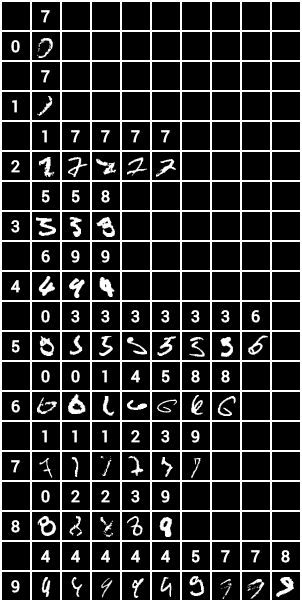

.. _mnist:

MNIST
=====

Scripts
*******

- `mnist.q <https://github.com/ktorch/examples/blob/master/mnist/mnist.q>`_ - script to read in MNIST data
- `conv.q <https://github.com/ktorch/examples/blob/master/mnist/conv.q>`_ - convolutional model to classify MNIST digits
- `gan.q <https://github.com/ktorch/examples/blob/master/mnist/gan.q>`_ - generative adversarial network to generate digits
- `lstm.q <https://github.com/ktorch/examples/blob/master/mnist/lstm.q>`_ - alternate, recurrent form of model to classify digits

Downloading the data
********************

The MNIST dataset is available `here <http://yann.lecun.com/exdb/mnist/>`_.
The `mnist.q <https://github.com/ktorch/examples/blob/master/mnist/mnist.q>`_ - script assumes the downloaded binary files are uncompressed in a ``data/`` directory that exists at the same level as the script with files:

::

   examples/mnist
   examples/mnist/mnist.q
   examples/mnist/conv.q
   examples/mnist/gan.q
   examples/mnist/lstm.q
   examples/mnist/data
   examples/mnist/data/t10k-images-idx3-ubyte
   examples/mnist/data/t10k-labels-idx1-ubyte
   examples/mnist/data/train-images-idx3-ubyte
   examples/mnist/data/train-labels-idx1-ubyte

Loading the data into k/q
*************************

The `mnist.q <https://github.com/ktorch/examples/blob/master/mnist/mnist.q>`_ script creates a dictionary of images and labels.

::

   > q examples/mnist/mnist.q
   KDB+ 4.0 2020.05.04 Copyright (C) 1993-2020 Kx Systems
   l64/ 12(16)core 64037MB t alien 127.0.1.1 EXPIRE 2021.11.18 tom.fergson@gmail.com KOD #4173880

   q)mnist
   x| 0 0 0 0 0 0 0 0 0 0 0 0 0 0 0 0 0 0 0 0 0 0 0 0 0 0 0 0 0 0 0 0 0 0 0 0 0 ..
   y| 5 0 4 1 9 2 1 3 1 4 3 5 3 6 1 7 2 8 6 9 4 0 9 1 1 2 4 3 2 7 3 8 6 9 0 5 6 ..
   X| 0 0 0 0 0 0 0 0 0 0 0 0 0 0 0 0 0 0 0 0 0 0 0 0 0 0 0 0 0 0 0 0 0 0 0 0 0 ..
   Y| 7 2 1 0 4 1 4 9 5 9 0 6 9 0 1 5 9 7 3 4 9 6 6 5 4 0 7 4 0 1 3 1 3 4 7 2 7 ..
   n| ((0 0 0 0 0 0 0 0 0 0 0 0 0 0 0 0 0 0 0 0 0 0 0 0 0 0 0 0h;0 0 0 0 0 0 0 0..

   q)count each mnist
   x| 47040000
   y| 60000
   X| 7840000
   Y| 10000
   n| 10

Dictionary keys ```x``, ```y`` contain the 60,000 training images and labels (60,000 x 28 x 28 = 47,040,000),
keys ```X``, ```Y`` contain the 10,000 images and labels for testing the fitted model.
The ```n`` entry contains digits 0-9 used to label output:

::

   q)-2@7_-7_6_'-6_' "* "0=mnist.n 9;

        *****      
       *******     
      **** ***     
      ***  ****    
      ***   ***    
      ***   ***    
      *********    
       ********    
        *******    
           ***     
       *******     
       *******     
        ****       

Convolutional model
*******************

The `conv.q <https://github.com/ktorch/examples/blob/master/mnist/conv.q>`_ script builds a
`sequential <https://pytorch.org/docs/stable/generated/torch.nn.Sequential.html>`_ model with two i
`convolutional <https://pytorch.org/docs/stable/generated/torch.nn.Conv2d.html>`_ layers and a final set of two `linear <https://pytorch.org/docs/stable/generated/torch.nn.Linear.html>`_ modules and a `relu <https://pytorch.org/docs/stable/generated/torch.nn.ReLU.html>`_ activation function in between.

::

   q:module`sequential,
      enlist'[((`conv2d; 1;20;5);`relu;`drop;(`maxpool2d;2);
               (`conv2d;20;50;5);`relu;`drop;(`maxpool2d;2);`flatten;
               (`linear;800;500);`relu;`drop;(`linear;500;10))]


PyTorch's representation of the model looks like:

::

   q)-2 str q;
   torch::nn::Sequential(
     (0): torch::nn::Conv2d(1, 20, kernel_size=[5, 5], stride=[1, 1])
     (1): torch::nn::ReLU()
     (2): torch::nn::Dropout(p=0.5, inplace=false)
     (3): torch::nn::MaxPool2d(kernel_size=[2, 2], stride=[2, 2], padding=[0, 0], dilation=[1, 1], ceil_mode=false)
     (4): torch::nn::Conv2d(20, 50, kernel_size=[5, 5], stride=[1, 1])
     (5): torch::nn::ReLU()
     (6): torch::nn::Dropout(p=0.5, inplace=false)
     (7): torch::nn::MaxPool2d(kernel_size=[2, 2], stride=[2, 2], padding=[0, 0], dilation=[1, 1], ceil_mode=false)
     (8): torch::nn::Flatten(start_dim=1, end_dim=-1)
     (9): torch::nn::Linear(in_features=800, out_features=500, bias=true)
     (10): torch::nn::ReLU()
     (11): torch::nn::Dropout(p=0.5, inplace=false)
     (12): torch::nn::Linear(in_features=500, out_features=10, bias=true)
   )

Running the model over 30 epochs takes around 3 minutes on a single GTX 1080 gpu with accuracy of around 99.6%

::

   > q examples/mnist/conv.q
   KDB+ 4.0 2020.05.04 Copyright (C) 1993-2020 Kx Systems
   l64/ 12(16)core 64037MB

     1.  lr: 0.1000  loss: 0.189406  test: 0.0874  match: 98.63%
     2.  lr: 0.0997  loss: 0.080588  test: 0.0644  match: 98.88%
     3.  lr: 0.0989  loss: 0.064251  test: 0.0465  match: 99.01%
     4.  lr: 0.0976  loss: 0.059539  test: 0.0600  match: 99.14%
    ..
    27.  lr: 0.0043  loss: 0.010265  test: 0.0205  match: 99.56%
    28.  lr: 0.0024  loss: 0.010330  test: 0.0204  match: 99.58%
    29.  lr: 0.0011  loss: 0.010452  test: 0.0204  match: 99.59%
    30.  lr: 0.0003  loss: 0.009538  test: 0.0204  match: 99.59%

A dictionary of mismatches with keys for the digit and the mismatched digit indicated by the trained model:

::

   mismatches:
   0| ,7
   2| 7 7 7 7
   3| 2 5 8
   4| 9 9 9
   5| 0 3 3 3 3 3 3 6
   6| 0 0 1 1 4 5 8
   7| 1 1 1
   8| ,9
   9| 3 4 4 4 5 5 7 7 7 8 8

The `grid of mismatches `examples/mnist/out/conv.png <https://github.com/ktorch/examples/blob/master/mnist/out/conv.png>` is written to a .png file.




