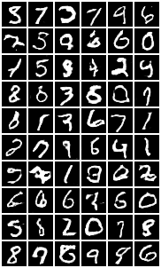
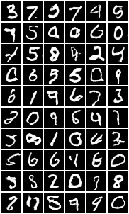
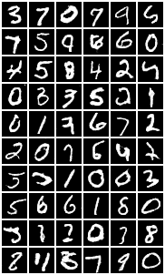

.. _mnist:

MNIST
=====

Scripts
*******

- `mnist.q <https://github.com/ktorch/examples/blob/master/mnist/mnist.q>`_ - script to read in MNIST data
- `logit.q <https://github.com/ktorch/examples/blob/master/mnist/logit.q>`_ - single layer regression model to classify MNIST digits
- `linear.q <https://github.com/ktorch/examples/blob/master/mnist/linear.q>`_ - 2-layer linear model
- `conv.q <https://github.com/ktorch/examples/blob/master/mnist/conv.q>`_ - convolutional model
- `swa.q <https://github.com/ktorch/examples/blob/master/mnist/swa.q>`_ - stochastic weight averaging of convolutional model
- `simple.q <https://github.com/ktorch/examples/blob/master/mnist/simple.q>`_ - implementation of `SimpNet <https://github.com/Coderx7/SimpNet>`_ with 13 convolutional layers
- `gan.q <https://github.com/ktorch/examples/blob/master/mnist/gan.q>`_ - generative adversarial network to generate digits
- `cgan.q <https://github.com/ktorch/examples/blob/master/mnist/cgan.q>`_ - conditional generative adversarial network to generate digits by class
- `lstm.q <https://github.com/ktorch/examples/blob/master/mnist/lstm.q>`_ - alternate, recurrent form of model to classify digits

Data
****

The MNIST dataset is available `here <http://yann.lecun.com/exdb/mnist/>`_.
The `mnist.q <https://github.com/ktorch/examples/blob/master/mnist/mnist.q>`_ - script assumes the downloaded binary files are uncompressed in a ``data/`` directory that exists at the same level as the script. The directory should have the following files:

::

   > ls -lh examples/mnist/data
   total 53M
   -rw-r--r-- 1 t t 7.5M May 17  2019 t10k-images-idx3-ubyte
   -rw-r--r-- 1 t t 9.8K May 17  2019 t10k-labels-idx1-ubyte
   -rw-r--r-- 1 t t  45M May 17  2019 train-images-idx3-ubyte
   -rw-r--r-- 1 t t  59K May 17  2019 train-labels-idx1-ubyte

Loading
^^^^^^^

The `mnist.q <https://github.com/ktorch/examples/blob/master/mnist/mnist.q>`_ script loads a :func:`mnist` function that creates a dictionary of images and labels from the raw data files:

.. function:: mnist(datadir) -> k dictionary of mnist data

   :param symbol datadir: null to use default directory derived from the path of the calling script else a symbol prefixed with a colon, e.g. ```:data``.
   :return: A dictionary of smallints, with keys ```x`` & ```y`` for training images and labels, along with keys ```X`` & ```Y`` for test images and labels.

::

   > q examples/mnist/mnist.q
   KDB+ 4.0 2020.05.04 Copyright (C) 1993-2020 Kx Systems
   l64/ 12(16)core 64037MB 

   q)d:mnist[]   /use default data directory

   q)d~mnist`:examples/mnist/data
   1b

   q)d
   x| 0 0 0 0 0 0 0 0 0 0 0 0 0 0 0 0 0 0 0 0 0 0 0 0 0 0 0 0 0 0 0 0 0 0 0 0 0 ..
   y| 5 0 4 1 9 2 1 3 1 4 3 5 3 6 1 7 2 8 6 9 4 0 9 1 1 2 4 3 2 7 3 8 6 9 0 5 6 ..
   X| 0 0 0 0 0 0 0 0 0 0 0 0 0 0 0 0 0 0 0 0 0 0 0 0 0 0 0 0 0 0 0 0 0 0 0 0 0 ..
   Y| 7 2 1 0 4 1 4 9 5 9 0 6 9 0 1 5 9 7 3 4 9 6 6 5 4 0 7 4 0 1 3 1 3 4 7 2 7 ..

   q)count each d
   x| 47040000
   y| 60000
   X| 7840000
   Y| 10000

   q)2*sum count each d
   109900000

   q)-22!d
   109900053

Dictionary keys ```x``, ```y`` contain the 60,000 training images and labels (60,000 x 28 x 28 = 47,040,000),
keys ```X``, ```Y`` contain the 10,000 images and labels for testing the fitted model.

Quick display
^^^^^^^^^^^^^
The :func:`showdigit` will output a rough text display of a random digit from a set of images & labels:

::

   q)showdigit . d`x`y
   2h
                               
             **********        
            ***********        
            *****   ****       
            ***      ***       
                     ***       
                    ****       
                   *****       
                  *****        
                 ******        
               ******          
             ******            
            *****              
          *****                
         *****                 
        *****                  
        ****                   
        ***                    
        *****************      
         *****************     
         *****************     
   

Digit labels
^^^^^^^^^^^^
The :func:`digits` function returns a font of digits 0-9 used to label output grids:

::

   q)n:digits[]
   q)-2@7_-7_6_'-6_' "* "0=n 9;
                
        *****      
       *******     
      **** ***     
      ***  ****    
      ***   ***    
      ***   ***    
      *********    
       ********    
        *******    
           ***     
       *******     
       *******     
        ****       


Single layer
************

The `logit.q <https://github.com/ktorch/examples/blob/master/mnist/logit.q>`_ script uses a single linear layer classify MNIST digits:

::

   q)\l examples/mnist/mnist.q
   q)d:mnist[`:examples/mnist/data]

   q)count each d
   x| 47040000
   y| 60000
   X| 7840000
   Y| 10000


Scale pixels
^^^^^^^^^^^^

The grayscale images are scaled to numbers between -1.0 and 1.0 and reshaped to 784 pixels each:

::

   q)d:@[;`y`Y;"j"$]@[d;`x`X;{resize("e"$-1+x%127.5;-1 784)}]

   q)count each d
   x| 60000
   y| 60000
   X| 10000
   Y| 10000


Model
^^^^^

A single `linear <https://pytorch.org/docs/stable/generated/torch.nn.Linear.html>`_ 
layer is used for the model,
along with the `cross entropy <https://pytorch.org/docs/stable/generated/torch.nn.CrossEntropyLoss.html>`_ loss function
and the `stochastic gradient descent <https://pytorch.org/docs/stable/generated/torch.optim.SGD.html>`_ optimizer:

::

   q)q:module enlist(`linear;784;10)
   q)elements q  /number of trainable parameters in model
   7850

   q)l:loss`ce
   q)o:opt(`sgd;q;.04)
   q)m:model(q;l;o)


Training
^^^^^^^^

The batch size for training is set to 100 and the training data set is to be shuffled at each epoch:

::

   q)train(m; `batchsize`shuffle; 100,1b)
   q)train(m; d`x; d`y);

The model is run for 20 passes through the training data taken 100 images at a time, completing in a few seconds:

::

   q)\ts:20 run m
   1652 528

The output of the model in evaluation mode (no gradient calculation) is a matrix of weights (logits),
1 row per observation and and 1 column for each of the 10 possible digits:

::

   q)y:evaluate(m; d`X)

   q)count y
   10000
   q)count y 0
   10

   q)y
   0.4986   -9.818 1.419   6.727     -2.822   0.384    -9.603  12.22   0.3794 3...
   5.541    0.1578 12.02   5.854     -13.88   6.12     7.144   -18.24  5.024  -1..
   -6.993   7.03   2.669   1.506     -2.313   0.1852   -0.3844 1.582   1.081  -1..
   ..

The predicted digit of the model is the column with the largest weight for each row:

::

   q){x?max x}each evaluate(m; d`X)
   7 2 1 0 4 1 4 9 6 9 0 6 9 0 1 5 9 7 3 4 9 6 6 5 4 0 7 4 0 1 3 1 3 6 7 2 7 1 2..

   q)avg d.Y={x?max x}each evaluate(m; d`X)
   0.9238

   q)string[100*avg d.Y={x?max x}each evaluate(m; d`X)],"% test accuracy"
   "92.38% test accuracy"

The single linear layer model usually achieves about 92% accuracy after 20 epochs, closer to 92.5% with 100 epochs.
Run time on a 12-core i7 CPU is under 2 seconds.


Linear layers
*************

The `linear.q <https://github.com/ktorch/examples/blob/master/mnist/linear.q>`_ scripts creates a model of 2 
`linear <https://pytorch.org/docs/stable/generated/torch.nn.Linear.html>`_ layers with a
`relu <https://pytorch.org/docs/stable/generated/torch.nn.ReLU.html>`_ activation function in between.

Model
^^^^^

The training images are treated as a list of 784 pixels and passed through each linear layer and the activation function.

- input: 100 x 784
- first linear layer: 100 x 784  x  784 x 800 -> 100 x 800
- relu: 100 x 800
- linear: 100 x 800  x  800 x 10 -> 100 x 10

::

   q)q:module seq(`sequential; (`linear;784;800); `relu; (`linear;800;10))

   q)-2 str q;
   torch::nn::Sequential(
     (0): torch::nn::Linear(in_features=784, out_features=800, bias=true)
     (1): torch::nn::ReLU()
     (2): torch::nn::Linear(in_features=800, out_features=10, bias=true)
   )

   q)elements q
   636010

Training
^^^^^^^^

This model has 636,010 trainable parameters and usually converges to around 98.5% accuracy on the test dataset.
The output is the same shape and type as in the single linear model in 
the `logit.q <https://github.com/ktorch/examples/blob/master/mnist/logit.q>`_ script,
but the depth and large increase in parameters makes for a better predictor:

::

   > q examples/mnist/linear.q
   KDB+ 4.0 2021.07.12 Copyright (C) 1993-2021 Kx Systems
   l64/ 12(16)core 64033MB
   
     1.  loss: 0.269020  test: 0.1316  accuracy: 96.16%
     2.  loss: 0.127664  test: 0.1177  accuracy: 96.28%
     3.  loss: 0.094828  test: 0.1350  accuracy: 95.54%
     4.  loss: 0.081220  test: 0.0955  accuracy: 97.19%
     5.  loss: 0.068084  test: 0.1122  accuracy: 96.54%
    ..
    45.  loss: 0.000066  test: 0.0835  accuracy: 98.53%
    46.  loss: 0.000066  test: 0.0836  accuracy: 98.56%
    47.  loss: 0.000061  test: 0.0839  accuracy: 98.55%
    48.  loss: 0.000060  test: 0.0841  accuracy: 98.55%
    49.  loss: 0.000059  test: 0.0843  accuracy: 98.54%
    50.  loss: 0.000058  test: 0.0845  accuracy: 98.55%
   9289 4195504

Run time on a NVIDIA GeForce GTX 1080 Ti GPU is around 10 seconds, closer to 30 seconds on a 12-core i7 CPU.


Convolutional model
*******************

The `conv.q <https://github.com/ktorch/examples/blob/master/mnist/conv.q>`_ script builds a
`sequential <https://pytorch.org/docs/stable/generated/torch.nn.Sequential.html>`_ model with two
`convolutional <https://pytorch.org/docs/stable/generated/torch.nn.Conv2d.html>`_ layers
and a final set of two `linear <https://pytorch.org/docs/stable/generated/torch.nn.Linear.html>`_ modules
and a `relu <https://pytorch.org/docs/stable/generated/torch.nn.ReLU.html>`_ activation function in between.


Model
^^^^^

This model uses the training images as rectangles of 28 x 28 pixels, with the convolutions capturing more spatial information
then the linear models in the 
`logit.q <https://github.com/ktorch/examples/blob/master/mnist/logit.q>`_ and
`linear.q <https://github.com/ktorch/examples/blob/master/mnist/linear.q>`_ scripts.

::

   q)q:(`sequential; (`conv2d; 1;20;5); `relu; `drop; (`maxpool2d;2))
   q)q,:            ((`conv2d;20;50;5); `relu; `drop; (`maxpool2d;2); `flatten)
   q)q,:            ((`linear;800;500); `relu; `drop; (`linear;500;10))

   q)q:seq q  /enlist all but 1st

   q)q
   `sequential
   ,(`conv2d;1;20;5)
   ,`relu
   ,`drop
   ,(`maxpool2d;2)
   ,(`conv2d;20;50;5)
   ,`relu
   ,`drop
   ,(`maxpool2d;2)
   ,`flatten
   ,(`linear;800;500)
   ,`relu
   ,`drop
   ,(`linear;500;10)


The PyTorch's representation of the model:

::

   q)-2 str q;
   torch::nn::Sequential(
     (0): torch::nn::Conv2d(1, 20, kernel_size=[5, 5], stride=[1, 1])
     (1): torch::nn::ReLU()
     (2): torch::nn::Dropout(p=0.5, inplace=false)
     (3): torch::nn::MaxPool2d(kernel_size=2, stride=2, padding=0, dilation=1)
     (4): torch::nn::Conv2d(20, 50, kernel_size=[5, 5], stride=[1, 1])
     (5): torch::nn::ReLU()
     (6): torch::nn::Dropout(p=0.5, inplace=false)
     (7): torch::nn::MaxPool2d(kernel_size=2, stride=2, padding=0, dilation=1)
     (8): torch::nn::Flatten(start_dim=1, end_dim=-1)
     (9): torch::nn::Linear(in_features=800, out_features=500, bias=true)
     (10): torch::nn::ReLU()
     (11): torch::nn::Dropout(p=0.5, inplace=false)
     (12): torch::nn::Linear(in_features=500, out_features=10, bias=true)
   )


Training
^^^^^^^^

Running the model for 50 epochs takes around 25 seconds on a single NVIDIA GeForce GTX 1080 Ti GPU with accuracy of around 99.6%
Training on a 12-core i7 CPU takes around 6 minutes.
A log of some training runs is available `here <https://github.com/ktorch/examples/blob/master/mnist/out/conv.log>`_.

::

   KDB+ 4.0 2021.07.12 Copyright (C) 1993-2021 Kx Systems
   l64/ 12(16)core 64033MB

    1.  lr: 0.0100  training loss: 0.827390  test accuracy: 96.84%
    2.  lr: 0.0100  training loss: 0.194377  test accuracy: 98.77%
    3.  lr: 0.0100  training loss: 0.154955  test accuracy: 98.88%
   ..
   48.  lr: 0.0002  training loss: 0.087358  test accuracy: 99.61%
   49.  lr: 0.0002  training loss: 0.087596  test accuracy: 99.60%
   50.  lr: 0.0002  training loss: 0.087125  test accuracy: 99.64%


A dictionary of mismatches -- keys for the digit and the corresponding mismatches predicted by the model -- is output:

::

   mismatches:
   0| ,7
   1| ,3
   2| 1 7 7 7 7
   3| ,5
   4| ,9
   5| 0 3 3 3 3 6
   6| 0 0 1 4 5
   7| 1 1 2 8
   8| 3 9
   9| 4 4 4 4 4 4 5 5 7 7

The grid of mismatches, `examples/mnist/out/conv.png, <https://github.com/ktorch/examples/blob/master/mnist/out/conv.png>`_ is written to a .png file.
The row labels are the model's classification and the column labels are the actual digit.
In the example below, most of the mismatches involve the digit ``9``, which the model mistakes for ``4``, ``5``  and ``7``.


Weight averaging
****************

The `swa.q <https://github.com/ktorch/examples/blob/master/mnist/swa.q>`_ script implements an example of stochastic weight averaging of the convolutional model used in the `conv.q <https://github.com/ktorch/examples/blob/master/mnist/conv.q>`_ script.

The k-api implements `weight averaging <https://ktorch.readthedocs.io/en/latest/swa.html>`_ by taking a copy of the parameters at some point in the training and maintaining a running average after each epoch.
At the end of training, the averaged parameters are written back to the model.

In this implementation, the convolutional model is trained for 50 epochs with weight averaging in effect for the final 20 epochs.
While the averaging provides only a mild improvement over the regular training procedure (average accuracy of ``99.592%`` vs ``99.585%``),
the script is included to provide an example of the averaging technique using the k api.

The distribution of accuracy of 100 trials of the two training methods:

::

   accuracy| regular averaging
   --------| -----------------
   99.45   | 1                
   99.51   |         1        
   99.53   | 6       3        
   99.54   | 5       5        
   99.55   | 9       9        
   99.56   | 9       7        
   99.57   | 14      4        
   99.58   | 3       10       
   99.59   | 14      11       
   99.6    | 12      11       
   99.61   | 9       14       
   99.62   | 4       12       
   99.63   | 5       4        
   99.64   | 6       4        
   99.65   |         3        
   99.66   | 1       1        
   99.68   | 1       1        
   99.71   | 1                

A log of 100 trials using weight averaging is available `here <https://github.com/ktorch/examples/blob/master/mnist/out/swa.log>`_.

SimpNet
*******

The paper `Towards Principled Design of Deep Convolutional Networks: Introducing SimpNet <https://arxiv.org/abs/1802.06205>`_
proposes a simple network of convolutional layers followed by normalization layers.
The model is implemented in the `simple.q <https://github.com/ktorch/examples/blob/master/mnist/simple.q>`_ script,
creating a deeper convolutional model than the implemention in `conv.q <https://github.com/ktorch/examples/blob/master/mnist/conv.q>`_.


Model
^^^^^

The model is build around a set of 13 convolutional layers,
with additional `batchnorm <https://pytorch.org/docs/stable/generated/torch.nn.BatchNorm2d.html>`_ layers 
before the `relu <https://pytorch.org/docs/stable/generated/torch.nn.ReLU.html>`_ activation function
and followed by a `dropout <https://pytorch.org/docs/stable/generated/torch.nn.Dropout2d.html>`_ layer and interspersed with 
`max pooling <https://pytorch.org/docs/stable/generated/torch.nn.MaxPool2d.html>`_ layers after  the 5th and 10th convlutions.
The network finishes with  a global max pooling layer 
and a `linear <https://pytorch.org/docs/stable/generated/torch.nn.Linear.html>`_ layer
to transform the model output into a matrix of one row per input image and 10 columns of weights for each digit.

The script builds a list of layer settings:

::

   / input output size pool
   q:( 1    66    3    0;
      66    64    3    0;
      64    64    3    0;
      64    64    3    0;
      64    96    3    2;
      96    96    3    0;
      96    96    3    0;
      96    96    3    0;
      96    96    3    0;
      96   144    3    2;
     144   144    1    0;
     144   178    1    0;
     178   216    3    7)

And defines a helper function to translate the settings into a set of layers:

::

   f:{[i;o;s;p]
    c:(`conv2d;i;o;s;1;`same);      /convolution layer w'padding=same
    b:(`batchnorm2d;o;1e-05;.05);   /batchnorm w'momentum of .95
    f:`relu; d:(`drop;.2); m:(`maxpool2d;p);
    / final global max pool needs reshape & linear layer
    if[p=7; r:(`reshape;-1,o); l:(`linear;o;10)];
    $[p=0; (c;b;f;d); p=2; (c;b;f;m;d); (c;b;f;m;r;d;l)]}

   q)f . q 0
   (`conv2d;1;66;3;1;`same)
   (`batchnorm2d;66;1e-05;0.05)
   `relu
   (`drop;0.2)

   q)f . last q
   (`conv2d;178;216;3;1;`same)
   (`batchnorm2d;216;1e-05;0.05)
   `relu
   (`maxpool2d;7)
   (`reshape;-1 216)
   (`drop;0.2)
   (`linear;216;10)

The layers are all defined as child modules of one sequential container:

::

   q)`sequential,enlist each raze f ./:q
   `sequential
   ,(`conv2d;1;66;3;1;`same)
   ,(`batchnorm2d;66;1e-05;0.05)
   ,`relu
   ,(`drop;0.2)
   ,(`conv2d;66;64;3;1;`same)
   ,(`batchnorm2d;64;1e-05;0.05)
   ,`relu
   ,(`drop;0.2)
   ..
   `conv2d 144 178 1 1 `same  
   `batchnorm2d 178 1e-05 0.05
   relu                       
   `drop 0.2                  
   `conv2d 178 216 3 1 `same  
   `batchnorm2d 216 1e-05 0.05
   relu                       
   `maxpool2d 7               
   `reshape -1 216            
   `drop 0.2                  
   `linear 216 10          

The PyTorch representation of the model is `here <https://github.com/ktorch/examples/blob/master/mnist/out/simple.txt>`_.

Training
^^^^^^^^

Comparing the SimpNet model to the one in the 
`conv.q <https://github.com/ktorch/examples/blob/master/mnist/conv.q>`_ script, there is an increase in trainable parameters from around 400,000 to 1 million.
But it is the depth of the SimpNet model that has more of an impact on training time: the simpler convolutional model uses 13 layers whereas the SimpNet model uses 57 layers.
The increased depth of the model increases training time to 17 seconds per epoch,
about 14 minutes for 50 epochs for an accuracy increase from around 99.6% to 99.7%
(a log of some training runs using a NVIDIA GeForce GTX 1080 Ti GPU is available
`here <https://github.com/ktorch/examples/blob/master/mnist/out/simple.log>`_).

::

   > q examples/mnist/simple.q
   KDB+ 4.0 2021.07.12 Copyright (C) 1993-2021 Kx Systems
   l64/ 12(16)core 64033MB

   epochs: 50, batch size: 100, iterations per epoch: 600
     1.  lr: 0.0100  training loss: 0.503514  test accuracy: 94.19%
     2.  lr: 0.0100  training loss: 0.166132  test accuracy: 95.26%
     3.  lr: 0.0100  training loss: 0.148934  test accuracy: 97.09%
    ..
    47.  lr: 0.0002  training loss: 0.080834  test accuracy: 99.69%
    48.  lr: 0.0001  training loss: 0.080072  test accuracy: 99.74%
    49.  lr: 0.0000  training loss: 0.079776  test accuracy: 99.72%
    50.  lr: 0.0000  training loss: 0.079329  test accuracy: 99.73%

   mismatches:
   1| 3 6
   2| 0 7
   3| 1 5
   4| 9 9
   5| 3 3 6
   6| 0 5
   7| 1 1 2 2 2
   8| 2 2 5 9
   9| 4 4 4 4 7

   grid of mismatches: examples/mnist/out/simple.png


Weight averaging
^^^^^^^^^^^^^^^^

A `weight averaging <https://github.com/ktorch/examples/blob/master/mnist/wsimple.q>`_  version of the model trains for 75 epochs, with the average of the weights for the final 25 epochs used as the model parameters.  A training run of the weighted average version is `here <https://github.com/ktorch/examples/blob/master/mnist/out/wsimple.log>`_, along with a `grid <https://github.com/ktorch/examples/blob/master/mnist/out/wsimple.png>`_ of mismatches.

GAN
***

The `gan.q <https://github.com/ktorch/examples/blob/master/mnist/gan.q>`_ script builds a Generative Adverserial Network (GAN). 
It consists of a discriminator model and a generator model to create new MNIST digits using random inputs: the generator model is trained to convince the discriminator model that the digits are part of the handwritten dataset.

Model
^^^^^

Define convolution sizes and a helper function to build both generator and discriminator models:

::

   q)n:100 256 128 64
   q)gan:{to(x:module seq `sequential,x;y); model(x; loss`bce; opt(`adam;x;.0002;.5))}

Define the generator layers:

::

   q)a:`pad`bias!(1;0b)
   q)g :((`convtranspose2d;n 0;n 1;4;1_a); (`batchnorm2d;n 1); `relu)  / 256 x  4 x  4
   q)g,:((`convtranspose2d;n 1;n 2;3;2;a); (`batchnorm2d;n 2); `relu)  / 128 x  7 x  7
   q)g,:((`convtranspose2d;n 2;n 3;4;2;a); (`batchnorm2d;n 3); `relu)  /  64 x 14 x 14
   q)g,:((`convtranspose2d;n 3;  1;4;2;a); `tanh)                      /   1 x 28 x 28

   q)g:gan[g]`cpu

The generator is designed to take random noise and generate 28 x 28 images that resemble the MNIST handwritten digits:

::

   q)z:tensor(`randn;60 100 1 1)

   q)x:forward(g;z)

   q)size x
   60 1 28 28

The adversarial design of a GAN requires an accompanying discriminator:

::

   q)a:`bias,0b
   q)d :((`conv2d;  1;n 3;4;2;1;a); (`leakyrelu; 0.2))                      /  64 x 14 x 14
   q)d,:((`conv2d;n 3;n 2;4;2;1;a); (`batchnorm2d;n 2); (`leakyrelu; 0.2))  / 128 x  7 x  7
   q)d,:((`conv2d;n 2;n 1;4;2;1;a); (`batchnorm2d;n 1); (`leakyrelu; 0.2))  / 256 x  3 x  3
   q)d,:((`conv2d;n 1;  1;3;1;0;a); `sigmoid; (`flatten;0))                 /   1 x  1 x  1

   q)d:gan[d]`cpu

The discriminator is designed to take handwritten digits or generated digits and return a number close to 1 for handwritten digits and close to 0 if generated.

::

   q)z:tensor(`randn;60 100 1 1)
   q)x:forward(g;z)

   q)y:forward(d;x)

   q)size y
   ,60
   q)tensor y
   0.3427 0.5647 0.3511 0.4858 0.2941 0.3766 0.3467 0.3052 0.4612 0.4087 0.3725 ..

The PyTorch representation of the generator and discriminator is `here <https://github.com/ktorch/examples/blob/master/mnist/out/gan.txt>`_.

Training
^^^^^^^^

After the generator and discriminator models are defined, the training proceeds in three steps:

- train discriminator with handwritten images as inputs and targets close to 1.0 (``fit1``)
- train discriminator again with generated images as inputs and targets of 0.0 (``fit2``)
- train the generator via the gradients from the discriminator using generated images and targets of 1.0 (``fit3``)

These steps are defined in ``fit1``, ``fit2`` and ``fit3``, called in turn by the function ``fit``:

::

   fit1:{[d;x;y] nograd d; uniform(y;.8;1); backward(d;x;y)}
   fit2:{[d;x;y] x:detach x; l:backward(d;x;y); free x; step d; l}
   fit3:{[d;g;x;y] nograd g; l:backward(d;x;y); free x; step g; l}

   fit:{[d;g;t;x;z;w;i]
   /d:discriminator, g:generator, t:targets, x:images, z:noise, w:batch size, i:index
    batch(x;w;i);             /take i'th subset of MNIST images
    l0:fit1[d;x;t 0];         /train discriminator w'real images
    normal z; x:forward(g;z); /generate images from noise
    l1:fit2[d;x;t 1];         /train d w'generated images
    l2:fit3[d;g;x;t 2];       /train generator w'discriminator accepting generated images
    (l0+l1),l2}               /return discriminator & generator loss

The training output from running for 20 passes through the set of 60,000 handwritten & generated images:

::

   > q examples/mnist/gan.q
   KDB+ 4.0 2021.07.12 Copyright (C) 1993-2021 Kx Systems
   l64/ 12(16)core 64033MB

   Epochs: 20, batch size: 60, iterations per epoch: 1000
   Epoch: 1    10:11:55    Median loss for discriminator: 0.763	generator: 2.026
   Epoch: 2    10:12:02    Median loss for discriminator: 0.712	generator: 1.473
   Epoch: 3    10:12:09    Median loss for discriminator: 0.682	generator: 1.879
   Epoch: 4    10:12:16    Median loss for discriminator: 0.667	generator: 1.624
   Epoch: 5    10:12:23    Median loss for discriminator: 0.653	generator: 2.126
   Epoch: 6    10:12:30    Median loss for discriminator: 0.635	generator: 2.829
   Epoch: 7    10:12:37    Median loss for discriminator: 0.607	generator: 2.334
   Epoch: 8    10:12:44    Median loss for discriminator: 0.610	generator: 2.524
   Epoch: 9    10:12:51    Median loss for discriminator: 0.589	generator: 2.558
   Epoch: 10   10:12:58    Median loss for discriminator: 0.606	generator: 3.371
   Epoch: 11   10:13:05    Median loss for discriminator: 0.577	generator: 2.708
   Epoch: 12   10:13:12    Median loss for discriminator: 0.564	generator: 2.534
   Epoch: 13   10:13:19    Median loss for discriminator: 0.556	generator: 3.406
   Epoch: 14   10:13:26    Median loss for discriminator: 0.551	generator: 2.644
   Epoch: 15   10:13:33    Median loss for discriminator: 0.544	generator: 3.241
   Epoch: 16   10:13:40    Median loss for discriminator: 0.531	generator: 2.638
   Epoch: 17   10:13:47    Median loss for discriminator: 0.535	generator: 3.336
   Epoch: 18   10:13:54    Median loss for discriminator: 0.525	generator: 3.293
   Epoch: 19   10:14:01    Median loss for discriminator: 0.528	generator: 3.681
   Epoch: 20   10:14:08    Median loss for discriminator: 0.510	generator: 3.458

   Generated digits in dir examples/mnist/out/, gan01.png - gan20.png, gan.gif


The script produces a grid of generated images after each epoch and creates a GIF file that shows each epoch in succession (requires
`convert <https://manpages.ubuntu.com/manpages/trusty/man1/convert.im6.1.html>`_ utility).
Each grid depicts the digits generated by the same set of random variables used at the end of each epoch:









.. table::
   :align: center

   +--------+--------+--------+--------+---------+
   ||gan01| ||gan05| ||gan10| ||gan20| ||gangif| |
   +--------+--------+--------+--------+---------+
   |Epoch 1 |Epoch 5 |Epoch 10|Epoch 20| 1 to 20 |
   +--------+--------+--------+--------+---------+


Conditional GAN
***************

The `cgan.q <https://github.com/ktorch/examples/blob/master/mnist/cgan.q>`_ script 
builds a generator and discriminator model similar to the models in
`gan.q <https://github.com/ktorch/examples/blob/master/mnist/cgan.q>`_,
but conditioning the images with their class so that images can be generated and
evaluated with their accompanying target digit included in the input.

Model
^^^^^

The generator and discriminator use a k api module
`seqjoin <https://ktorch.readthedocs.io/en/latest/kmodules.html#module-seqjoin>`_
to define the processing of the class 0-9 and how this part of the input is combined with the
random numbers used in the generator and the images used as input to the discriminator.

For the generator module the random noise is joined with the target digit via a learned
`embedding <https://pytorch.org/docs/stable/generated/torch.nn.Embedding.html>`_ and a
`reshape <https://ktorch.readthedocs.io/en/latest/kmodules.html#module-reshape>`_ so that the two tensors can be 
`catenated <https://ktorch.readthedocs.io/en/latest/kmodules.html#cat>`_ together:

::

   e:10

   g:((0; `sequential);
      (1; `seqjoin);
      (2; `sequential);          / 1st fork: random vars
      (2; `sequential);          / 2nd fork: digit
      (3; (`embed;10;e));
      (3; (`reshape;-1,e,1,1));
      (2; (`cat;1));             / join inputs
   ..

For the discriminator, a wider 
`embedding <https://pytorch.org/docs/stable/generated/torch.nn.Embedding.html>`_ is used, along with a
`linear <https://pytorch.org/docs/stable/generated/torch.nn.Linear.html>`_ layer, then a
`reshape <https://ktorch.readthedocs.io/en/latest/kmodules.html#module-reshape>`_ 
to create tensors of ``batchsize x channel x height x width`` which are 
`catenated <https://ktorch.readthedocs.io/en/latest/kmodules.html#cat>`_ together:

::

   e:50

   d:((0; `sequential);
      (1; `seqjoin);
      (2; `sequential);     / 1st fork: images passed through empty sequential
      (2; `sequential);     / 2nd fork: digit -> embedding -> liner -> 28 x 28
      (3; (`embed;10;e));
      (3; (`linear;e;28*28));
      (3; (`reshape;-1 1 28 28));
      (2; (`cat;1));
      ..

Once the inputs of noise & digit for the generator, and image & digit for the discriminator are catenated together,
the remainder of the models are a series of
`convolutions <https://pytorch.org/docs/stable/generated/torch.nn.Conv2d.html>`_ or
`transposed convolutions <https://pytorch.org/docs/stable/generated/torch.nn.ConvTranspose2d.html>`_,
followed by
`normalization <https://pytorch.org/docs/stable/generated/torch.nn.BatchNorm2d.html>`_ layers and 
`relu <https://pytorch.org/docs/stable/generated/torch.nn.ReLU.html>`_ or 
`leakyrelu <https://pytorch.org/docs/stable/generated/torch.nn.LeakyReLU.html>`_ activations.

The PyTorch representation of the generator and discriminator modules is available 
`here <https://github.com/ktorch/examples/blob/master/mnist/out/cgan.txt>`_.

Training
^^^^^^^^

After the generator and discriminator models are defined, the training proceeds in the same three steps used by the
`gan.q <https://github.com/ktorch/examples/blob/master/mnist/gan.q>`_ script,
but with the addition of the digits ``0-9`` accompanying the random noise of the generator or the images of the discriminator:

- train discriminator with handwritten images & labels as joint inputs and targets close to 1.0 (``fit1``)
- train discriminator again with generated images & labels as inputs and targets of 0.0 (``fit2``)
- train the generator via the gradients from the discriminator using generated images & lables and targets of 1.0 (``fit3``)

These steps are defined in ``fit1``, ``fit2`` and ``fit3``, called in turn by the function ``fit``:

::

   fit1:{[d;t;v] nograd d; uniform(t;0.8;1.0); backward(d;v;t)}
   fit2:{[d;t;x;y] x:detach x; l:backward(d;(x;y);t); free x; step d; l}
   fit3:{[d;g;t;x;y] nograd g; l:backward(d;(x;y);t); free(x;y); step g; l}

   fit:{[d;g;t;v;z;w;i]
    batch(v;w;i);                              /i'th subset of MNIST images & labels
    l1:fit1[d;t 0;v];                          /train on real images
    normal z; y:tensor(`randint;10;w;c,`long); /random inputs & labels
    x:forward(g;z;y);                          /generate images
    l2:fit2[d;t 1;x;y];                        /train discriminator w'generated images & labels
    l3:fit3[d;g;t 2;x;y];                      /train generator: get discriminator to recognize as real
    (l1+l2),l3}                                /discriminator & generator loss

::

   > q examples/mnist/cgan.q
   KDB+ 4.0 2021.07.12 Copyright (C) 1993-2021 Kx Systems
   l64/ 12(16)core 64033MB

   Epochs: 20, batch size: 60, iterations per epoch: 1000
   Epoch: 1    09:54:00    Median loss for discriminator: 0.947	generator: 1.494
   Epoch: 2    09:54:08    Median loss for discriminator: 1.136	generator: 1.325
   Epoch: 3    09:54:15    Median loss for discriminator: 1.146	generator: 0.880
   Epoch: 4    09:54:23    Median loss for discriminator: 1.144	generator: 1.235
   Epoch: 5    09:54:30    Median loss for discriminator: 1.139	generator: 1.388
   Epoch: 6    09:54:38    Median loss for discriminator: 1.124	generator: 1.453
   Epoch: 7    09:54:45    Median loss for discriminator: 1.096	generator: 1.298
   Epoch: 8    09:54:53    Median loss for discriminator: 1.066	generator: 1.707
   Epoch: 9    09:55:00    Median loss for discriminator: 1.043	generator: 1.814
   Epoch: 10   09:55:08    Median loss for discriminator: 1.013	generator: 1.496
   Epoch: 11   09:55:16    Median loss for discriminator: 0.971	generator: 1.598
   Epoch: 12   09:55:23    Median loss for discriminator: 0.932	generator: 2.290
   Epoch: 13   09:55:31    Median loss for discriminator: 0.899	generator: 2.212
   Epoch: 14   09:55:38    Median loss for discriminator: 0.876	generator: 1.867
   Epoch: 15   09:55:46    Median loss for discriminator: 0.843	generator: 1.691
   Epoch: 16   09:55:54    Median loss for discriminator: 0.831	generator: 2.061
   Epoch: 17   09:56:01    Median loss for discriminator: 0.811	generator: 1.649
   Epoch: 18   09:56:09    Median loss for discriminator: 0.787	generator: 2.345
   Epoch: 19   09:56:17    Median loss for discriminator: 0.770	generator: 2.343
   Epoch: 20   09:56:24    Median loss for discriminator: 0.759	generator: 2.244

   Generated digits in dir examples/mnist/out/, cgan01.png - cgan20.png, cgan.gif

Run time is about 2.5 minutes on a NVIDIA GeForce GTX 1080 Ti GPU and closer to 40 minutes on 12-core i7 CPU.

The script produces a grid of generated images after each epoch and creates a GIF file that shows each epoch in succession (requires ``convert`` utility).
The rows of each grid are generated by the same set of random variables conditioned by the different digits 0-9; each column represents different images of the same digit generated by different randome variables:


.. table::
   :align: center

   +----------+----------+----------+-----------+
   | |cgan01| | |cgan10| | |cgan20| | |cgangif| |
   +----------+----------+----------+-----------+
   | Epoch 1  | Epoch 10 | Epoch 20 |  1 to 20  |
   +----------+----------+----------+-----------+

Recurrent Model
***************

The `lstm.q <https://github.com/ktorch/examples/blob/master/mnist/lstm.q>`_ script uses a recurrent neural network to classify the digits.
Each row of the ``28 x 28`` pixel images can be used as a sequence to demonstrate the recurrent architecture with a familiar dataset.

Model
^^^^^
The k-api container module,
`recur <https://ktorch.readthedocs.io/en/latest/kmodules.html#module-recur>`_ is used to first call the PyTorch
`lstm <https://pytorch.org/docs/stable/generated/torch.nn.LSTM.html>`_ module and then the output sequence of the
`select <https://ktorch.readthedocs.io/en/latest/kmodules.html#select>`_ of the final column and the 
`linear <https://pytorch.org/docs/stable/generated/torch.nn.Linear.html>`_ transformation into a matrix of 10 columns of weights for each image.

::

   q:module`recur
   module(q; 1; (`lstm;     `lstm; 28; 128; 2; 1b; 1b))
   module(q; 1;  `sequential);
   module(q; 2; (`select;   `last; 1; -1))
   module(q; 2; (`linear;   `decode; 128; 10))

   q)-2 str q;
   knn::Recur(
     (lstm): (input_size=28, hidden_size=128, num_layers=2, bias=true,..
     (out): torch::nn::Sequential(
       (last): knn::Select(dim=1,ind=-1)
       (decode): torch::nn::Linear(in_features=128, out_features=10, bias=true)
     )
   )

Using a ``60 x 28 x 28`` tensor of random numbers as a placeholder for 60 MNIST images of digits,
the first forward calculation uses the 
`lstm <https://pytorch.org/docs/stable/generated/torch.nn.LSTM.html>`_ module to get the output and hidden state:

::

   q)x:tensor(`randn;60 28 28)
   q)y:forward(q;`lstm;x)

   q)size y
   60 28 128
   2  60 128
   2  60 128

The result, ``y``, is a vector of 3 tensors, the output of the ``lstm`` and the hidden and cell state of the sequence.
The final column of the output is selected and passed through a linear layer to get the weights for each digit:

::

   q)z:forward(q;`out;(y;0))

   q)size z
   60 10

Each subsequent call to the ``lstm`` module can include the hidden & cell state of the previous sequence:

::

   q)vector(y; 0; tensor(`randn;60 28 28))

   q)use[y]forward(q;`lstm;y)

   q)size y
   60 28 128
   2  60 128
   2  60 128

Training
^^^^^^^^

The script uses a cycling learning rate, using .001, .0005, .0002, .0001 repeatedly for 40 iterations through the data.
A recurrent model is not as accurate as the 
`convolutional <https://github.com/ktorch/examples/blob/master/mnist/conv.q>`_ model, with an accuracy of 99.20 - 99.30%,
running through 40 epochs in around 2 minutes on a NVIDIA GeForce GTX 1080 Ti GPU and 13 minutes on 12-core i7 CPU.

::

   KDB+ 4.0 2021.07.12 Copyright (C) 1993-2021 Kx Systems
   l64/ 12(16)core 64033MB

     1.  lr: 0.0010  training loss: 0.392026  test accuracy: 95.79%
     2.  lr: 0.0005  training loss: 0.087590  test accuracy: 97.74%
     3.  lr: 0.0002  training loss: 0.053733  test accuracy: 98.29%
     4.  lr: 0.0001  training loss: 0.038863  test accuracy: 98.49%
     5.  lr: 0.0010  training loss: 0.090845  test accuracy: 97.88%
    ..
    36.  lr: 0.0001  training loss: 0.001683  test accuracy: 99.25%
    37.  lr: 0.0010  training loss: 0.023589  test accuracy: 99.01%
    38.  lr: 0.0005  training loss: 0.007428  test accuracy: 99.23%
    39.  lr: 0.0002  training loss: 0.002182  test accuracy: 99.27%
    40.  lr: 0.0001  training loss: 0.001296  test accuracy: 99.32%
   108020 4195680

   mismatches:
   0| ,7
   1| 3 7
   2| 0 0 1 3 4 7 7 7 7
   3| 2 2 5 7
   4| 1 6 6 6 8 9 9 9 9 9 9
   5| 0 3 3 3 3 3 3 3 3 6 8
   6| 0 0 0 1 1 4 8
   7| 1 2 2 2 3 3 9
   8| 0 5 5 7 7 9
   9| 4 4 4 4 4 4 5 5 7 7

   grid of mismatches: examples/mnist/out/lstm.png

The grid of mismatches, `examples/mnist/out/lstm.png, <https://github.com/ktorch/examples/blob/master/mnist/out/lstm.png>`_ is written to a .png file.
The row labels are the model's classification and the column labels are the actual digit.


